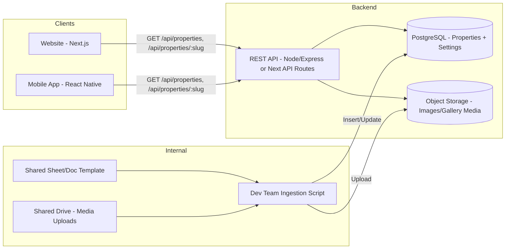

# Backend Design Document
## Raheja Properties Showcase — Website & Mobile App

**Last Updated:** 2026-07-16

---

## 1. Purpose

Single backend serving read-only property data to both the public website and the mobile app, plus an internal (non-public) path for the dev team to ingest content updates submitted by Raheja's team.

## 2. High-Level Architecture

## 3. Components

### 3.1 API Layer
- Stateless REST API, read-only for public consumers.
- Endpoints (see TRD §4): `/api/properties`, `/api/properties/:slug`, `/api/settings`.
- No authentication required for these GET endpoints (fully public showcase data).
- Response caching (CDN/ISR) since data changes infrequently.

### 3.2 Database
- PostgreSQL, two main tables: `properties`, `settings` (see TRD §3 for schema).
- `is_published` + `display_order` fields let the dev team control what's visible and in what order without deleting data.

### 3.3 Media Storage
- Images/gallery media stored in object storage (S3/Cloudinary), referenced by URL in the `properties` table.
- Serves both website (via CDN/optimized `<Image>` components) and app (via standard image URLs).

### 3.4 Internal Ingestion Path (No Public Admin Panel in v1)
- Not a public-facing feature. Dev team manually/semi-manually maps the shared Sheet/Doc + Drive media into the database using an internal script or direct DB entry.
- Protected by basic auth/API key if exposed as an endpoint at all — otherwise handled entirely outside the public API (direct DB access by dev team).
- Designed to be replaceable later by a lightweight admin CRUD UI without changing the underlying schema — a deliberate v2 upgrade path.

## 4. Data Flow — Content Update

1. Raheja's team updates the shared Sheet/Doc + Drive folder with new/changed property info.
2. Dev team runs ingestion (manual/script) → updates `properties` table + uploads media to storage.
3. Website: next deploy or ISR revalidation picks up the change; served via CDN.
4. App: fetches live from `/api/properties` on each launch/refresh — reflects the change immediately, no app-store release needed.
5. App-store releases are reserved for actual app code/feature changes, decoupled entirely from content updates.

## 5. Security & Access

- Public API surface: read-only, no user data collected, minimal attack surface.
- Internal ingestion path: not public; access restricted to dev team (direct DB/script access or a protected internal-only endpoint with API key).
- No PII stored anywhere in v1 (no forms, no accounts, no contact submissions).

## 6. Scalability & Reliability

- Expected scale is small (tens of properties, moderate traffic) — a single small API instance + managed Postgres is sufficient.
- CDN caching on both API responses (where safe) and static assets keeps load low and latency small for a showcase-type read-heavy workload.

## 7. Future-Proofing (Not Built in v1)

- Schema already supports a future admin CMS (CRUD UI) without migration — just add an authenticated write path on top of the existing `properties` table.
- Could add analytics/view-count fields to `properties` later without breaking existing consumers.
- Could add search/filter fields (e.g. price range, property type) later as additive columns.
