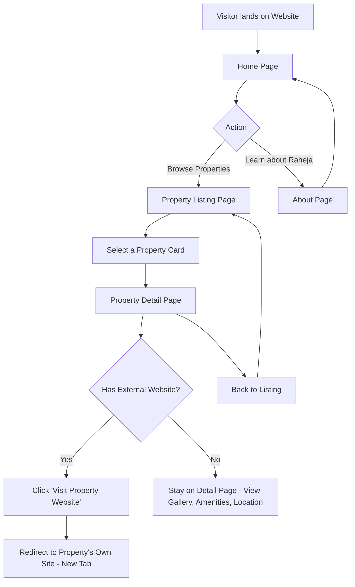
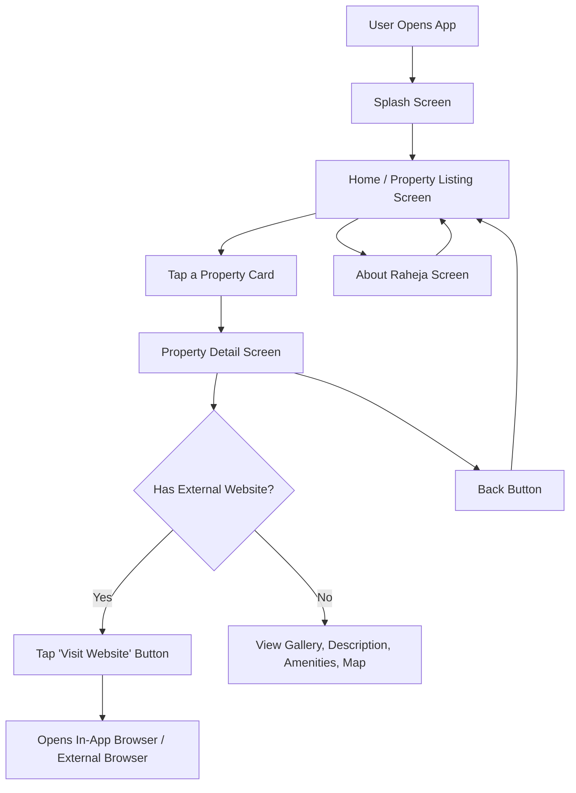

# User Flow
## Raheja Properties Showcase — Website & Mobile App

**Last Updated:** 2026-07-16

This document covers the end-user journey through the website and app. Since there are no accounts, forms, or transactions, the flow is intentionally simple: browse → view details → (optional) exit to external property site.

---

## 1. Website User Flow

## 2. Mobile App User Flow

## 3. Key Screens / Pages Summary

| Screen/Page | Purpose | Key Elements |
|---|---|---|
| Home | First impression, brand intro | Hero banner, featured properties, nav to listing |
| Property Listing | Browse all properties | Grid/list of property cards (image, name, location, status tag) |
| Property Detail | Deep dive on one property | Gallery, description, amenities, map/location, status, external website link (if any) |
| About Raheja | Founder/brand story | Static content, contact phone/WhatsApp (no form) |

## 4. Explicit Non-Flows (v1)

- No login/signup flow.
- No "contact us" / inquiry form flow.
- No search/filter flow (deferred).
- No checkout/booking flow.
