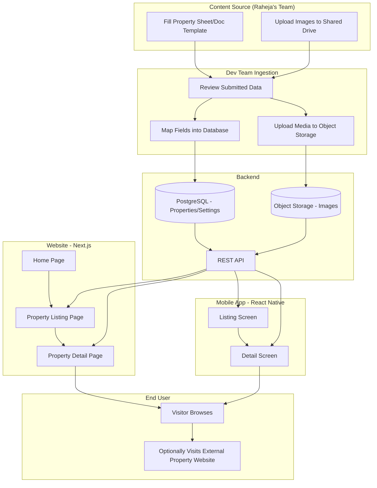
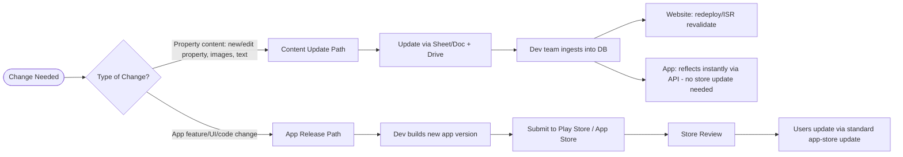

# Workflow Diagram
## Raheja Properties Showcase — Website & Mobile App

**Last Updated:** 2026-07-16

This document ties together the system architecture and the content-update business process into one end-to-end view.

---

## 1. End-to-End System & Content Workflow

## 2. App Release vs Content Update Workflow

## 3. Notes

- The two workflows above are intentionally decoupled: routine property updates (the common case) never require an app-store release.
- App-store releases are reserved for actual app-shell changes (new features, bug fixes, design changes).
- This keeps Raheja's showcase easy to keep current without ongoing app-store overhead.
